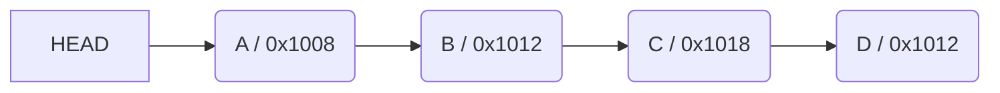

# 리스트 List

순서를 가진 데이터의 집합을 가리키는 추상자료형(abstract data type)

구현 방법에 따라 크게 두 가지로 나뉜다.

1. 순차 리스트 : 배열을 기반으로 구현된 리스트
2. 연결 리스트 : 메모리의 동적할당을 기반으로 구현된 리스트

# 순차 리스트

### 구현 방법

1차원 배열에 항목들을 순서대로 저장한다.

데이터의 종류와 구조에 따라 구조화된 자료구조를 만들어 배열에 저장할 수도 있다.

```java
int[] L = {4, 9, 11, 23};
```

### 삽입/삭제 연산

삽입 연산시 다음 항목들을 뒤로 이동해야 한다.

삭제 위치 다음 항목들을 앞으로 이동해야 한다.

### 문제점

단순 배열을 이용한 순차리스트를 구현해 사용하는 경우, 자료의 삽입/삭제 연산 과정에서 연속적인 메모리 배열을 위해 원소들을 이동시키는 작업이 필요하다.

원소의 개수가 많고 삽입/삭제 연산이 빈번하게 일어날수록 작업에 소요되는 시간이 크게 증가한다.

배열의 크기가 정해져 있는 경우, 실제로 사용될 메모리보다 크게 할당하여 메모리의 낭비를 초래할 수도 있고, 반대로 할당된 메모리보다 많은 자료를 사용하여 새롭게 배열을 만들어 작업을 해야 하는 경우가 발생할 수도 있다.

# 연결 리스트

- 단순 연결 리스트
  - 노드 연결 한 방향 관리
  - 링크 1개
- 이중 연결 리스트
  - 노드 연결 양방향
  - 링크 2개
- 원형 연결 리스트
  - 시작과 끝이 연결

## 단순 연결 리스트

노드가 하나의 링크 필드에 의해 다음 노드와 연결되는 구조를 가진다

헤드가 가장 앞의 노드를 가리키고, 링크 필드가 연속적으로 다음노드를 가리킨다.

링크 필드가 `Null`인 노드가 연결 리스트의 가장 마지막 노드이다.

헤드가 가리키고 있는 링크 필드를 먼저 탐색



### 삭제 연산

1. 삭제할 노드의 앞 노드(선행 노드) 탐색
2. 삭제할 노드의 링크 필드를 선행 노드의 링크 필드에 복사

### 단순 연결 리스트 응용 - 스택 구현

마지막에 `push`한 노드를 head로 링크

`pop`할 때 head를 head 다음 노드로 이동 시킨 후 원래 head가 가리키던 노드 제거

# 리스트 관련 알고리즘

## 슬라이딩 윈도우

보통 배열이나 리스트에서 `고정된 크기`의 연속된 구간을 효율적으로 탐색하는 기법

고정 사이즈의 윈도우가 이동하면서 윈도우 내에 있는 데이터를 이용해 문제를 풀이하는 알고리즘

각 윈도우의 공통된 교집합의 정보를 재사용하고, 차이가 나는 양쪽 끝 원소만 갱신하는 방법

배열이나 리스트의 요소의 일정 범위의 값을 비교할 때 사용하면 매우 유용

```
구간 길이가 일정한 two-pointer algorithm이라 생각할 수 있음
```