# 서로소 집합

서로소 또는 상호배타 집합들은 서로 중복 포함된 원소가 없는 집합

즉, `교집합이 없음`

집합에 속한 하나의 특정 멤버를 통해 각 집합들을 구분함

이 특정 멤버를 `대표자(representative)`라 함

### 서로소 집합을 표현하는 방법
- 연결 리스트
- 트리

### 서로소 집합 연산
- Make-Set(x)
- Find-Set(x)
- Union(x, y)

### 서로소 집합의 예

```
Make-Set(x)
Make-Set(y)
Make-Set(a)
Make-Set(b)

# (x), (y), (a), (b)

Union(x, y)
Union(a, b)

# (x, y), (a, b)

Find-Set(y) # return x (representative)
Find-Set(a) # return a (representative)

Union(x, a)

# (x, y, a, b)
```

## 서로소 집합 표현 - 연결리스트

같은 집합의 원소들은 하나의 연결리스트로 관리

연결리스트의 맨 앞의 원소를 집합의 대표 원소로 삼는다.

각 원소는 집합의 대표 원소를 가리키는 링크를 갖는다.

대표 원소는 자신을 가르킨다

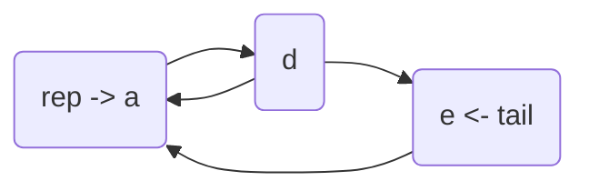

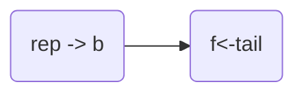

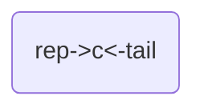

### 연결리스트 연산 예

```
Find-Set(e) # return a
Find-Set(f) # return b
```

맨 앞 요소(representative) 반환

```
Union(a, b)
```

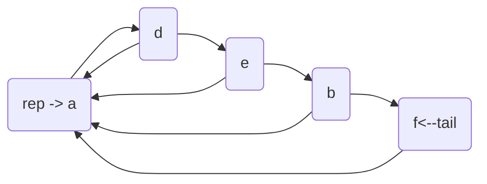

## 서로소 집합 표현 - 트리

같은 집합의 원소들을 하나의 트리로 표현

자식 노드가 부모 노드를 가리키며 루트 노드가 대표자가 됨

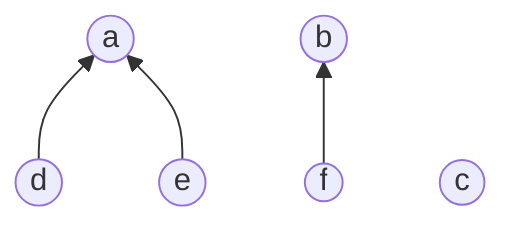

### 트리 연산 예

```
Make-Set(a) ~ Make-Set(f)
```


```
Union(c, d)
```

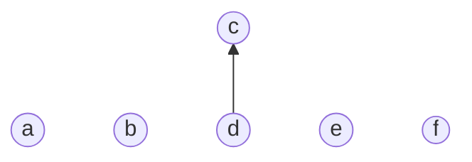

```
Union(e, f)
```

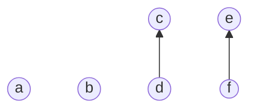

```
Union(d, f)
```

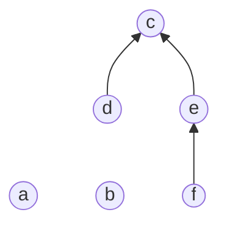

```
Find-Set(c) # return c
Find-Set(d) # return c
Find-Set(e) # return c
Find-Set(f) # return c
```

서로소 집합을 표현한 트리의 배열을 이용한 저장된 모습

<table>
    <tr>
        <th>Child</th>
        <td>a</td>
        <td>b</td>
        <td>c</td>
        <td>d</td>
        <td>e</td>
        <td>f</td>
    </tr>
    <tr>
        <th>Parent</th>
        <td>a</td>
        <td>b</td>
        <td>c</td>
        <td>c</td>
        <td>c</td>
        <td>e</td>
    </tr>
</table>

## 서로소 집합에 대한 연산

### Make-Set(x)

유일한 멤버 x를 포함하는 새로운 집합을 생성하는 연산

```
Make-Set(x)
    p[x] <- x
```

### Find-Set(x)

x를 포함하는 집합을 찾는 연산

```
Find-Set(x)
    IF x == p[x] : return x
    ELSE         : return Find-Set(p[x])
```

### Union(x, y)

x와 y를 포함하는 두 집합을 통합하는 연산

```
Union(x, y)
    IF Find-Set(y) == Find-Set(x) return;
    p[Find-Set(y)] <- Find-Set(x)
```

## 서로소 집합 - 트리 구현 최적화

편향 트리, 탐색 시간 최대 O(n)

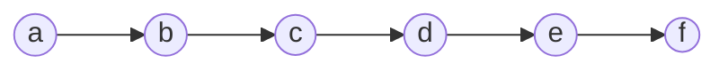

### 연산의 효율을 높이는 방법

- Rank를 이용한 Union
  - 각 노드는 자신을 루트로 하는 subtree의 높이를 rank로 저장
  - 저장할 때 rank가 낮은 집합을 rank가 높은 집합에 연결
- Path compression
  - Find-Set을 행하는 과정에서 만나는 모든 노드들이 직접 root를 가리키도록 포인터를 변경

### Union(c, g)

rank를 이용한 Union에서 rank의 변화가 없는 경우

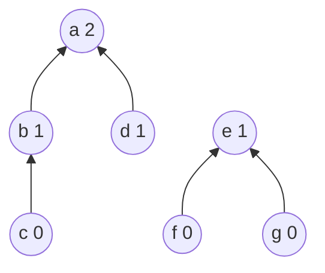

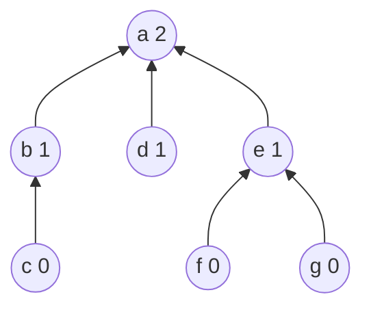

---

rank를 이용한 Union에서 rank의 증가하는 경우

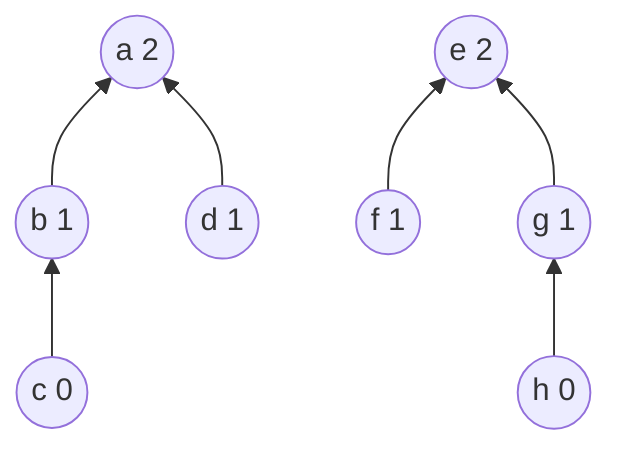

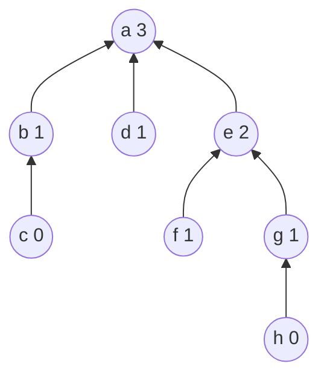

### Path Compression

path compression을 적용한 Find-Set 연산은 특정 노드에서 루트까지의 경로를 찾아 가면서 노드의 부모 정보를 갱신

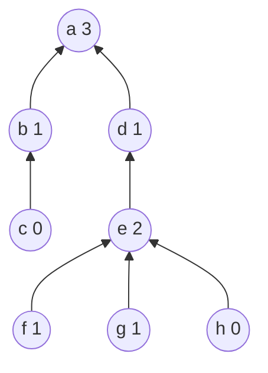

```
Find-set(h)
```

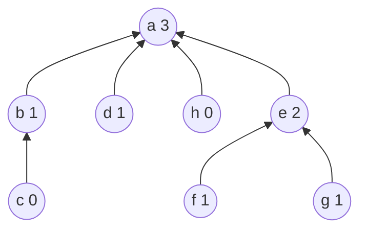

### Path Compression을 적용한 Find-Set 연산

```
Find-Set(x)
    IF x == p[x] : return x
    ELSE         : return Find-Set(p[x])
```

```
Find-Set(x)
    IF x == p[x] : return x
    ELSE         : return p[x] = Find-Set(p[x])
```