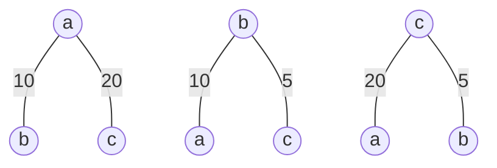

# 최소 신장 트리 (MST)

### 그래프에서 최소 비용 문제
1. 모든 정점을 연결하는 간성들의 가중치의 합이 최소가 되는 트리 -> 최소 신장 트리
2. 두 정점 사이의 최소 비용의 경로 찾기 -> 최단 경로

### 신장 트리
n 개의 정점으로 이루어진 무향 그래프에서 **n개의 정점**과 **n-1개의 간선**으로 이루어진 트리

트리 -> 사이클 발생 X

### 최소 신장 트리 (Minimum Spanning Tree)
무향 가중치 그래프에서 신장 트리를 구성하는 간선들의 **가중치의 합이 최소**인 신장 트리

완전 탐색으로 하기는 힘듬



# Kruskal 알고리즘

1. 최초, 모든 간선을 가중치에 따라 오름차순으로 정렬
2. 가중치가 가장 낮은 간선부터 선택하면서 트리를 증가시킴
    - 사이클이 존재하면 남아 있는 간선 중 그 다음으로 가중치가 낮은 간선 선택
3. n-1 개의 간선이 선택될 때까지 2를 반복 

```
1. 각 정점을 원소로하는 단위 서로소 집합(트리)으로 본다.
2. 선택되지 않은 간선 중 가장 비용이 유리한 간선 사용
  - 단, 싸이클이 발생하면 안 됨 : sindSet(a) != findSet(b)
    - 같은 부모(루트)인 경우 이미 연결된 상태
  - 간선 사용 의미 ==> a - b : union(a, b)

[2번 작업]을 N-1번의 union이 성공할 때 까지 반복
```

### 알고리즘

```
// G.V: 그래프의 정점 집합, G.E: 그래프의 간선 집합
// n : 정점 수, cnt : 선택한 간선 수, weight : 선택한 간선들의 가중치 합
MST-KRUSKAL(G)
  cnt = 0, weight = 0

  FOR vertex v in G.V
    Make-Set(v)
  End For

  Sort(G.E) // G.E에 포함된 간선들을 가중치 w를 이용한 오름차순 정렬
  // 정렬 시간이 대부분 차지. O(Edge E)

  FOR 간선 (u, v, w) ∈ G.E 선택 //신장 트리의 구성으로 선택한 간선의 개수가 n-1개가 될 때까지 반복
    IF Find-Set(u) # Find-Set(v) THEN
      Union(u, v)
      cnt = cnt + 1
      weight = weight + w
      IF cnt == n-1 THEN
        break
      End IF
    End IF
  End For
End MST-KRUSKAL()
```