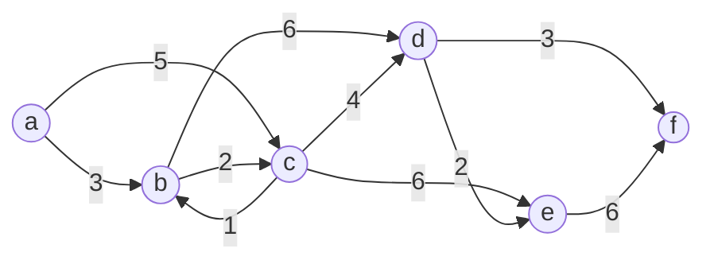

# Dijkstra 알고리즘

최단 거리가 갱신 되었다는 것은 경유지가 바뀌었다는 뜻

시작 정점 A의 경우 A->A->K(다음 정점) 으로 생각함

#### T = 0

| D   | a   | b   | c   | d   | e   | f   |
| --- | --- | --- | --- | --- | --- | --- |
| P   | -1  | -1  | -1  | -1  | -1  | -1  |
| W   | 0   | INF | INF | INF | INF | INF |

#### T = 1

a 선택 -> b, c 갱신

| D   | a   | b   | c   | d   | e   | f   |
| --- | --- | --- | --- | --- | --- | --- |
| P   | -1  | 0   | 0   | -1  | -1  | -1  |
| W   | 0   | 3   | 5   | INF | INF | INF |

#### T = 2

b 선택 -> d 갱신

| D   | a   | b   | c   | d   | e   | f   |
| --- | --- | --- | --- | --- | --- | --- |
| P   | -1  | 0   | 0   | 1   | -1  | -1  |
| W   | 0   | 3   | 5   | 9   | INF | INF |

#### T = 3

c 선택 -> e 갱신

| D   | a   | b   | c   | d   | e   | f   |
| --- | --- | --- | --- | --- | --- | --- |
| P   | -1  | 0   | 0   | 1   | 2   | -1  |
| W   | 0   | 3   | 5   | 9   | 11  | INF |

#### T = 4

d 선택 -> f 갱신

| D   | a   | b   | c   | d   | e   | f   |
| --- | --- | --- | --- | --- | --- | --- |
| P   | -1  | 0   | 0   | 1   | 2   | 3   |
| W   | 0   | 3   | 5   | 9   | 11  | 12  |

# Dijkstra 알고리즘 with PriorityQueue

간선이 너무 많은 경우 pq보다 인접 리스트가 더 빠름

- pq : O(ElogE)
- 인접 리스트 : O(ElogV)

# 0-1 BFS