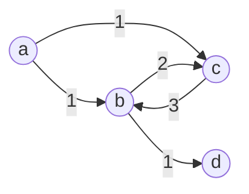

## 재귀 호출과 메모이제이션

재귀 호출 -> 하향식 접근 설계

메모이제이션 -> 기존 계산된 결과 저장 및 재사용

상태 공간 트리를 그려보며 얼마나 많이 재사용 하는지 확인

같은 매개변수를 갖는 함수 호출 발생 -> 항상 수행 결과는 같다. -> X
Pure Function 일 때만 수행 결과 보장

메모이제이션
- 메모되지 않은 경우 : 연산 수행 후 메모리 저장 (넣기)
- 메모된 경우 : 꺼내 쓰기 (바로 리턴) -> 연산 X

피보나치 수를 구하는 알고리즘에서 fibo(N)에 메모이제이션을 적용하면 실행 시간을 O(N)으로 줄일 수 있다.

## 동적 계획법 DP

- 하향식 설계 + 메모이제이션
- 점화식 + 상향식

상태정의 부분문제 -> 만능 X
저장할 공간이 필요
- 추가 메모리 소비
- 연산에 대한 오버헤드 감소 

동적 계획법(Dynamic Programming)은 그리디 알고리즘과 같이 최적화 문제를 해결하는 알고리즘이다.

동적 계획법은 먼저 작은 부분 문제들의 해들을 구하고 이들을 이용하여 보다 큰 크기의 부분 문제들을 해결하여,

최종적으로 원래 주어진 문제를 해결하는 알고리즘 설계 기법이다.

동적 계획법을 적용하려는 문제는 필히 다음과 같은 요건을 가지고 있어야 한다.

- 중복 부분 문제 구조 (Overlapping subproblems)
- 최적 부분 문제 구조 (Optimal substructure)

### 중복 부분 문제

DP는 큰 문제를 이루는 작은 문제들을 먼저 해결하고 작은 문제들의 최적해(Optimal Solution)를 이용하여 순환적은로 큰 문제를 해결한다.
- 순환적인 관계(Recurrence Relation)를 명시적으로 표현하기 위해서 동적 계획법에서는 일반적으로 수학적 도구인 점화식을 사용한다.

DP는 문제의 순환적인 성질 때문에 이전에 계산되어졌던 작은 문제의 해가 다른 어딘가에서 필요한게 되는데(Overlapping subproblems) 이를 위해 DP에서는 이미 해결된 작은 문제들의 해들을 어떤 저장 공간(table)에 저장하게 된다.

그리고 이렇게 저장된 해들이 다시 필요할 때 마다 해를  얻기 위해 다시 문제를 재계산하지 않고 table의 참조를 통해서 중복된 계산을 피하게 된다.

### 최적 부분 문제 구조

동적 계획법이 최적화에 대한 어느 문제에나 적용될 수 있는 것은 아니다. 주어진 문제가 최적화의 원칙(Principle of Optimality)을 만족해야만 동적 계획법을 효율적으로 적용할 수 있다.

최적화의 원칙이란 어떤 문제에 대한 해가 최적일 때 그 해를 구성하는 작은 문제드르이 해 역시 최적이어야 한다는 것이다. 동적 계획법의 방법자체가 큰 문제의 최적 해를 작은 문제의 최적해 들을 이용하여 구하기 때문에 만약 큰 문제의 최적해가 작은 문제들의 쵲적해들로 구성되지 않는다면 이 문제는 동적 계획법을 적용할 수 없다.

최적의 원칙이 적용되지 않는 예: 최장 경로 문제
- A에서 D로 최장 경로는 [A, B, C, D]가 된다.
- 그러나, 이 경로의 부분 경로인 A에서 C로의 최장 경로는 [A, C]가 아니라 [A, B, C]이다.
- 최적의 원칙이 적용되징 않는다.
- 따라서 최장경로 문제는 DP로 해결할 수 없다.

분할 정복
- 연관 없는 부분 문제로 분할 한다.
- 부분 문제를 재귀적으로 해결한다.
- 부분문제의 해를 결합(Combine)한다.
- 예 : 병합 정렬, 퀵 정렬

DP
- 부분 문제들이 연관이 없으면 적용할 수 없다.
- 즉, 부분 문제들은 더 작은 부분 문제들을 공유한다.
- 모든 부분 문제를 한 번만 계산하고 결과를 저장하고 재사용한다.

DP에는 부분 문제들 사이에 의존적 관계가 존재한다.
- 예를 들면 EFG의 해가 C를 해결하는데 사용되어지는 관계가 있다.

이러한 관계는 문제에 따라 다르고, 대부분의 경우 뚜렷이 보이지 않아서 함축적인 순서(implicit order)라고 한다.

분할 정복은 하향식 방법으로 DP는 상향식 방법으로 접근한다.

### DP 접근 방법

최적해 구조의 특성을 파악하다
- 문제를 부분 문제로 나눈다.

최적해의 값을 재귀적으로 정의하라
- 부분 문제의 최적해 값에 기반하여 문제의 최적해 값을 정의한다.

상향식 방법으로 최적해의 값을 계산하라
- 가장 작은 부분 문제부터 해를 구한 뒤 테이블에 저장한다.
- 테이블에 저장되어 있는 부분 문제의 해를 이용하여 점차적으로 상위 부분 문제의 최적해를 구한다.(상향식 방법)