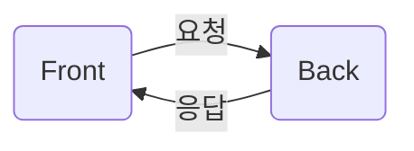

## 웹 프로그램

- 네트워크 너머의 서버에서 존재하며 웹을 통해서 서비스되는 프로그램
- 비지니스 로직을 위한 백엔드와 사용자 인터페이스를 위한 프론트엔드로 구성

- Web Server (\*Live Server)
  - 소규모 서비스에서는 생략할 수 있음
  - 정적 요청 : 정적 리소스 응답 (HTML, CSS, JS)
  - 동적 요청 : Servlet에 동적 요청 처리
- WAS - Web Application Server (\*Tomcat)
  - Servlet : 동적 요청 처리
  - Business Logic(Java)
  - Persistence Logic
  - Presentation Logic
  - DB Server : JDBC

## Container와 Context

### WAA, Container, Context

물리적인 서버는 네트워크에서 접근하기 위해서 ip주로를 갖음 - HTTP 기반으로 통신

- 서버에서는 WAS가 설치되어 있어 HTTP 기반의 웹 서비스 처리

WAS는 일반적으로 80포 트에서 웹 서비스를 제공하며 개발용으로는 8080을 주로 사용

- WAS는 내부에 Servlet/JSP를 실행하는 엔진 (Servlet Container)을 포함
- WAS를 Container라고 부르기도 함
- Container Root가 WAS다.

WAS에서는 여러 가지 웹 애플리케이션이 동작 가능

- 각 애플리케이션의 실행 환경과 실행 정보 제공하는 것을 Context라고 함
- 엄밀히는 기능을 제공하는 애플리케이션과 실행 환경으로 다르지만 거의 동일한 개념으로 사용

클라이언트

--http-->

서버

- context A
- context B

WAS : port 8080
ip : localhost

htts://localhost:`8080`/contextA - Container Root

htts://localhost:8080/`contextA` - Context Root

Content

- html, css, js

## Mavan

pom.xml - Project Object Model

프로젝트에 사용하는 모든 라이브러리를 관리하는 파일 - `packge.json`이랑 비슷한가?

maven: java 기반의 프로젝트 관리 도구로 주로 `빌드 자동화`와 `의존성 관리`에 사용

maven의 효능

- 프로젝트 구조 표준화
- 빌드 자동화
- 의존성 관리

## Servlet

WAS에서 실행되는 Java Web Component

- WAS를 Servlet Container라고도 한다.

Servlet의 장점

- java의 OOP 기반으로 작성
  - 유지보수성 및 재활용성 우수하며 플랫폼 독립적
- 높은 성능
  - 하나의 서블릿 갯ㄱ체만 생성하며 멀티스레딩을 지원하여 요청의 동시 처리가 가능
  - Thread Safe 한가?
- 확장성
  - 필터를 통한 모듈의 전/후 처리, 리스너를 이용한 이벤트 기반 처리 및 스프링 등 다양한 프레임워크와 통합 용이

Servlet 단점

- Business logic과 Presentaion logic(HTML code)가 섞여서 나타남
  - Servlet + JSP의 Model 2 방식으로 처리
